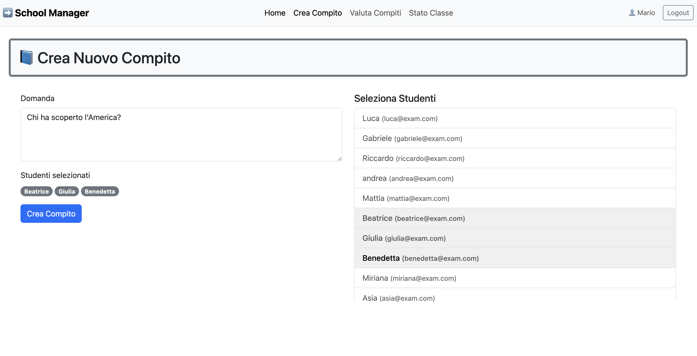
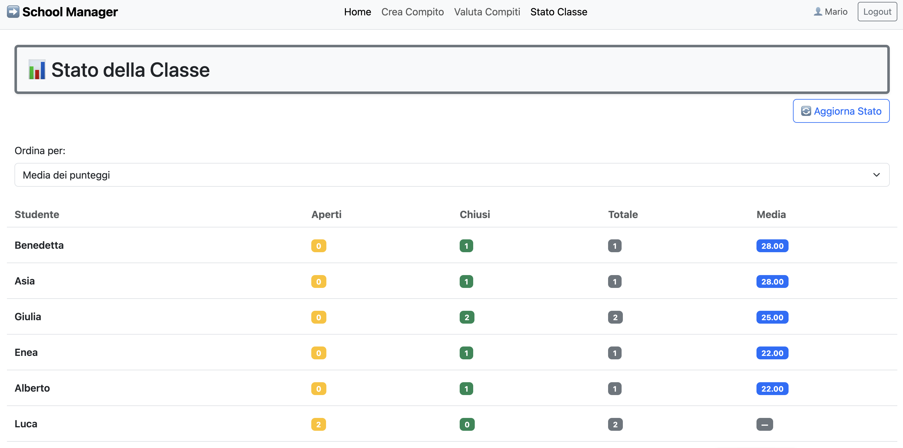

# Exam: "Compiti"
## mario898-dev

## React Client Application Routes

| Route                     | Descrizione                                                                                                                                                                                                                                                         |
| ------------------------- | ------------------------------------------------------------------------------------------------------------------------------------------------------------------------------------------------------------------------------------------------------------------- |
| `/`                       | **Entry Point** dell’applicazione. Gli utenti devono autenticarsi per accedere alle funzionalità dell'app.                                                                                                                                                          |
| `/teacher`                | Pagina riservata ai docenti. Visualizza le regole di utilizzo del proprio account.                                                                                                                                                                                  |
| `/teacher/nuovo-compito`  | Permette al docente di **assegnare un nuovo compito** a un gruppo di studenti. Include un menù a tendina per la selezione e un form per la descrizione del compito|
| `/teacher/valuta-compiti` | Il docente può **valutare compiti aperti** per i quali è stata inviata almeno una risposta. Il voto è un intero tra 0 e 30. Dopo la valutazione, il compito diventa “chiuso” e non è più modificabile.                                                              |
| `/teacher/stato-classe`   | Il docente visualizza **statistiche sui propri studenti**: compiti aperti/chiusi, media ponderata dei voti. I dati sono ordinabili per nome, media o numero totale di compiti.                                                                                                |
| `/student`                | Pagina informativa con le regole di utilizzo dell’account per gli studenti.                                                                                                                                                                                         |
| `/student/compiti`        | Mostra agli studenti i **compiti aperti** a cui partecipano. Possono inviare o modificare una risposta finché il compito non è valutato.                                                                                                                            |
| `/student/punteggi`       | Lo studente può vedere i **punteggi ricevuti** e una **media ponderata** dei voti. Il peso di ciascun voto è inversamente proporzionale al numero di membri del gruppo.                                                                                             |
| `*`                        | Pagina di errore **404 - Not Found**. Mostrata quando l’utente visita una route non esistente. Se l’utente è autenticato, viene offerto un pulsante per tornare alla sua **home personale** (studente o docente).                                           |


## API Server
---
- **API Autenticazione**: 
---
#### `POST /api/sessions`

- **Descrizione**:  
  Effettua il login di un utente (docente o studente) tramite autenticazione locale (`email` + `password`). In caso di successo, viene avviata una sessione e restituito l’oggetto utente.

- **Request body**:
  ```json
  {
    "email": "mario.rossi@docenti.univ.it",
    "password": "password123"
  }
- **Response**:
  - **Status code**: `200 OK`
  - **Body**:
    ```json
    {
      "id": 1,
      "name": "Mario",
      "email": "mario@exam.com",
      "role": "teacher"
    }
    ```
- **Errori**:
  - `401 Unauthorized`: credenziali non valide
    ```json
     { "error": "Login fallito" }
    ```
  - `500 Internal Server Error`: errore durante l'autenticazione

#### `DELETE /api/sessions/current`

- **Descrizione**:  
  Termina la sessione dell’utente autenticato, effettuando il logout.

- **Request parameters**:  
  Nessuno.

- **Request body**:  
  _none_

- **Response**:
  - **Status code**: `204 No Content`
  - **Body**: _nessun contenuto restituito_

- **Errori**:  
  Nessuno esplicitamente gestito. Eventuali problemi con `req.logout()` sarebbero interni a Passport.

#### `GET /api/sessions/current`

- **Descrizione**:  
  Restituisce i dati dell’utente attualmente autenticato.  
  Può essere utilizzato al caricamento dell’app per mantenere la sessione attiva sul client.

- **Request parameters**:  
  Nessuno.

- **Request body**:  
  _none_

- **Response**:
  - **Status code**: `200 OK`
  - **Body**:
    ```json
    {
      "id": 1,
      "name": "Mario",
      "email": "mario@exam.com",
      "role": "teacher"
    }
    ```

- **Errori**:
  - `401 Unauthorized`: nessuna sessione attiva.
    ```json
    { "error": "Utente non autenticato" }
    ```
---
- **API Studente**: 
---
#### `GET /api/student/tasks`

- **Descrizione**:  
  Restituisce la lista dei compiti **aperti** a cui partecipa lo studente autenticato.

- **Request body**:  
  _none_

- **Response**:
  - **Status code**: `200 OK`
  - **Body**:
    ```json
    [
      {
        "taskID": 12,
        "question": "Descrivi il protocollo HTTP",
        "risposta": "La risposta dello studente (se presente)",
        "status": "open"
      }
    ]
    ```

- **Errori**:
  - `500 Internal Server Error`: errore nel recupero dei compiti dal database.
    ```json
    { "error": "Errore nel recupero dei compiti" }
    ```

#### `PUT /api/student/tasks/:taskID/answer`

- **Descrizione**:  
  Permette allo studente autenticato di **inviare o aggiornare la risposta** a un compito aperto a cui partecipa.

- **Request body**:  
  - `:taskID` (number): ID del compito a cui si vuole rispondere.
   ```json
    {
    "risposta": "Testo della risposta dello studente"
    }
    ```

- **Response**:
  - **Status code**: `200 OK`
  - **Body**:
    ```json
    { "success": true }
    ```

- **Errori**:
  - `400 Bad Request`: se taskID non è un numero valido o risposta è mancante/non testuale
    ```json
    { "error": "Testo della risposta non valido" }
    ```
    ```json
    { "error": "ID del compito non valido" }
    ```
  - `403 Forbidden`: se il compito è già chiuso o lo studente non fa parte del gruppo
     ```json
    { "error": "Compito già valutato, non modificabile" }
     ```
     ```json
    { "error": "Accesso non autorizzato a questo compito" }
     ```
  - `404 Not Found`: se il compito con taskID non esiste
     ```json
    { "error": "Compito non trovato" }
     ```
  -  `500 Internal Server Error`: errore durante il salvataggio della risposta
     ```json
     { "error": "Errore nel salvataggio della risposta" }
     ```
#### `GET /api/student/grades`
 
- **Descrizione**:  
  Restituisce l’elenco dei compiti **chiusi e valutati** a cui lo studente autenticato ha partecipato, includendo il punteggio ricevuto e la **media ponderata** dei voti.  
  Il peso di ciascun voto è calcolato come l'inverso del numero di membri del gruppo.

- **Request parameters**:  
  Nessuno. Lo studente è identificato automaticamente dalla sessione autenticata.

- **Request body**:  
  _none_

- **Response**:
  - **Status code**: `200 OK`
  - **Body**:
    ```json
    {
      "compiti": [
        {
          "taskID": 17,
          "question": "Le rose son rosse?",
          "score": 28
        },
        {
          "taskID": 21,
          "question": "Le rose son blu?",
          "score": 25
        }
      ],
      "media": 26.42
    }
    ```
    - `compiti`: array di oggetti con ID, domanda e voto ottenuto per ciascun compito chiuso.
    - `media`: media ponderata calcolata. Se lo studente non ha compiti chiusi, il campo sarà `null`.

- **Errori**:
  - `500 Internal Server Error`: errore nel recupero dei dati dal database.
    ```json
    { "error": "Errore nel recupero dei punteggi" }
    ```
---
- **API Docente**: 
---
#### `POST /api/tasks`

- **Descrizione**:  
  Permette a un docente autenticato di **creare un nuovo compito** e assegnarlo a un gruppo di studenti. Il compito viene inizialmente creato con stato `"open"`.

- **Request body**:
  ```json
  {
    "domanda": "Spiega il funzionamento del protocollo TCP",
    "studenti": [3, 7, 9]
  }
  ```
- **Response**:
  - **Status code**: `201 Created`
  - **Body**:
  ```json
  {
    "success": true,
    "taskId": 42
  }
  ```
- **Errori**:
  - `400 Bad Request`: se i dati non sono validi
    ```json
    { "error": "Dati non validi" }
    ```
  - `500 Internal Server Error`: errore durante la creazione del compito o l'assegnazione dei membri
    ```json
    { "error": "Errore nella creazione del compito" }
    ```
#### `POST /api/tasks/check-group`

- **Descrizione**:  
  Verifica che il gruppo proposto di studenti **rispetti le regole di validità**:  
  nessuna coppia di studenti deve aver già partecipato **insieme** ad almeno **2 compiti** assegnati dallo **stesso docente**.

- **Request body**:
  ```json
  {
    "studentIds": [3, 5, 7]
  }
- **Response**:
  - **Status code**: `200 OK`
  - **Body**:
  ```json
  {
     "valido": true/false
  }
  ```
- **Errori**:
  - `400 Bad Request`: se i dati non sono validi
    ```json
      { "error": "Formato dati non valido" }
    ```
  - `500 Internal Server Error`: errore durante la creazione del compito o l'assegnazione dei membri
    ```json
      { "error": "Errore nella validazione del gruppo" }
    ```
#### `GET /api/students`

- **Descrizione**:  
  Restituisce l’elenco completo degli studenti registrati. Accessibile solo ai docenti autenticati.

- **Request parameters**:  
  Nessuno.

- **Request body**:  
  _none_

- **Response**:
  - **Status code**: `200 OK`
  - **Body**:
    ```json
    [
      {
        "id": 3,
        "name": "Mario Bianchi",
        "email": "mario.bianchi@studenti.univ.it"
      },
      {
        "id": 7,
        "name": "Luca Verdi",
        "email": "luca.verdi@studenti.univ.it"
      }
    ]
    ```

- **Errori**:
  - `500 Internal Server Error`: errore durante l'accesso al database.
    ```json
    { "error": "Errore nel recupero degli studenti" }
    ```
#### `GET /api/teacher/tasks`

- **Descrizione**:  
  Restituisce l’elenco di tutti i compiti creati dal docente autenticato. Ogni compito include informazioni sullo stato, eventuale risposta fornita dagli studenti e punteggio.

- **Request parameters**:  
  Nessuno. 

- **Request body**:  
  _none_

- **Response**:
  - **Status code**: `200 OK`
  - **Body**:
    ```json
    [
      {
        "taskID": 14,
        "question": "Cos'è un protocollo di livello applicativo?",
        "status": "open",
        "score": null,
        "risposta": "Esempi: HTTP, SMTP, FTP..."
      },
      {
        "taskID": 9,
        "question": "Spiega il concetto di DNS",
        "status": "closed",
        "score": 28,
        "risposta": "Il DNS risolve i nomi di dominio in indirizzi IP..."
      }
    ]
    ```

- **Errori**:
  - `500 Internal Server Error`: errore durante il recupero dei compiti dal database.
    ```json
    { "error": "Errore durante il recupero dei compiti" }
    ```
#### `PUT /api/teacher/tasks/:taskID/score`

- **Descrizione**:  
  Permette al docente autenticato di **valutare un compito aperto** che ha creato, assegnando un punteggio intero da 0 a 30. Dopo la valutazione, il compito viene chiuso e non potrà più essere modificato.

- **Request parameters**:
  - `:taskID` (number): ID del compito da valutare

- **Request body**:
  ```json
  {
    "score": 28
  }
- **Response**:
  - **Status code**: `200 OK`
  - **Body**:
    ```json
      {
        { "success": true }
      }
    ```
- **Errori**:
  - `400 Bad Request`: se taskID o score non sono validi o il compito non è valutabile
    ```json
    { "error": "Errore durante il recupero dei compiti" }
    ```
#### `GET /api/teacher/stato-classe`

- **Descrizione**:  
  Restituisce al docente autenticato un **riepilogo statistico** sugli studenti che partecipano ai suoi compiti.  
  Per ogni studente vengono indicati:
  - Numero di compiti aperti
  - Numero di compiti chiusi
  - Media ponderata dei punteggi ottenuti (sui soli compiti chiusi del docente)

- **Request parameters**:  
  Nessuno.

- **Request body**:  
  _none_

- **Response**:
  - **Status code**: `200 OK`
  - **Body**:
    ```json
    [
      {
        "id": 3,
        "name": "Mario Bianchi",
        "aperti": 1,
        "chiusi": 2,
        "media": 27.5
      },
      {
        "id": 7,
        "name": "Luca Verdi",
        "aperti": 0,
        "chiusi": 1,
        "media": 25.0
      }
    ]
    ```
    - `media`: può essere `null` se lo studente non ha compiti chiusi.

- **Errori**:
  - `500 Internal Server Error`: errore nel recupero dello stato della classe.
    ```json
    { "error": "Errore nel recupero dello stato della classe" }
    ```
---
## Database Tables
---

### Tabella `users`

Contiene le informazioni di base per tutti gli utenti (studenti e docenti).

| Campo           | Tipo     | Vincoli                            |
|-----------------|----------|-------------------------------------|
| `userID`        | Integer  | **Primary key**, auto-incrementale |
| `name`          | Text     |                                     |
| `email`         | Text     | **Not null**, **Univoca**           |
| `role`          | Text     | **Not null** (`student` / `teacher`)|
| `password_hash` | Text     | Hash della password                 |
| `salt`          | Text     | Sale usato per il password hashing  |

---

### Tabella `Tasks`

Contiene i compiti assegnati dai docenti.

| Campo          | Tipo     | Vincoli                                           |
|----------------|----------|---------------------------------------------------|
| `taskID`       | Integer  | **Primary key**, auto-incrementale               |
| `teacherID`    | Integer  | **Not null**, foreign key → `users(userID)`      |
| `question`     | Text     | **Not null**                                     |
| `status`       | Text     | **Not null** (`open` / `closed`)                 |
| `score`        | Integer  | Punteggio finale (0–30)                          |
| `answer_text`  | Text     | Risposta fornita dagli studenti                  |

---

### Tabella `task_Members`

Rappresenta l’associazione molti-a-molti tra compiti e studenti.

| Campo       | Tipo     | Vincoli                                      |
|-------------|----------|----------------------------------------------|
| `taskID`     | Integer  | **Not null**, foreign key → `Tasks(taskID)` |
| `studentID`  | Integer  | **Not null**, foreign key → `users(userID)` |


## Main React Components

- `CompitoCard` (in `components/Student/CompitoCard.jsx`): 
  Rappresenta un singolo compito assegnato allo studente, mostrando la domanda e se il compito è ancora aperto, viene mostrato un campo per inserire o modificare la risposta
   - Visualizza una singola domanda di compito assegnato allo studente
   - Mostra la risposta esistente(se presente) oppure un campo per scriverla o modificarla, se il compito è ancora aperto
   - Comunica eventuali modifiche alla risposta tramite la callback onRispostaChange
   - Permette l'invio della risposta tramite il bottone, usando la callback onInvio
   - Quando il compito viene chiuso, il contenuto diventa read-only

- `CompitoDaValutare` (in `components/Teacher/CompitoDaValutare.jsx`):
  Visualizza un compito creato dal docente, con relativa domanda e risposta degli studenti. Se il compito è ancora aperto, permette di inserire ed inviare una valutazione.
   - Visualizzare la domanda e la risposta di un compito assegnato 
   - Mostrare un campo di valutazione numerica(0-30) se il compito è aperto e la risposta è presente
   - Comunicare al genitore il punteggio inserito tramite la callback onChangeValutazione
   - Permette l'invio della valutazione tramite la callback onValuta, associata al bottone "valuta"
   - Mostrare un punteggio assegnato se il compito è stato già valutato
- `CompitoForm` (in `components/Teacher/CompitoForm.jsx`): 
  Fornisce il modulo per la creazione di un nuovo compito da parte del docente
   - Mostra gli studenti selezionati sotto forma di badge
   - Comunica al genitore eventuali modifiche alla domanda tramite la callback onDomandaChange
   - Gestisce l'invio del form tramite la callback onSubmit
   - Visualizza messaggi di errore/successo
- `SelezioneStudenti` (in `components/Teacher/ SelezionaStudenti.jsx`):
  Permette di selezionare un gruppo di studenti da una lista
   - Evidenzia graficamente gli studenti selezionati
   - Gestisce la selezione/deselezione tramite callback(onToggle) senza mantere stato interno
- `AppNavbar` (in `components/common/AppNavbar.jsx`)
  Visualizza la barra di navigazione principale dell’applicazione, adattando il menu in base al ruolo dell’utente (studente o docente) e mostrando il nome utente con opzione di logout
   - Fornisce una navigazione coerente in base all'utente autenticato
   - Visualizza il nome dell'utente loggato
   - Offre un bottone per il logout
- `Login` (in `components/Login.jsx`):
  Gestisce il modulo di autenticazione iniziale per studenti e docenti, permettendo di inserire le credenziali di accesso(email e password)
   - Visualizza il campo form con campo email e password
   - Alla pressione del bottone "Accedi" invoca onLogin(email,password)
   - Mostra un eventuale messaggio di errore
- `SchoolManager` (in `components/SchoolManager.jsx`):
  Gestisce l'intera logica dell'applicazione dopo l'avvio, coordinando autenticazione, routing, layout e navigazione protetta per docenti e studenti.
  - Esegue un controllo iniziale di autenticazione e ripristina la sessione
  - Imposta le route protette per studenti e docenti
  - Redirect automatico in base al ruolo
  - Layout condiviso con Navbar(defaultLayout)
  - Pagina iniziale HomePage e pagina di errore PageNotFound

- `CompitiAssegnati` (in `pages/Student/CompitiAssegnati.jsx`):
  Pagina principale per lo studente, mostra l'elenco dei compiti aperti assegnati.  
  - Recupera l'elenco dei compiti da un'API e gestisce il relativo stato.  
  - Mostra messaggi di errore/successo.  
  - Permette allo studente di scrivere, modificare e inviare la risposta.  
  - Mostra una lista di `CompitoCard`, una per ogni compito aperto.
- `PunteggiStudent` (in `pages/Student/PunteggiStudent.jsx`):
  Pagina per visualizzare i punteggi ricevuti dallo studente e la media ponderata finale.   
  - Recupera da API l’elenco dei compiti chiusi con i relativi punteggi.  
  - Mostra ogni compito valutato con la domanda e il punteggio ricevuto.  
  - Calcola e visualizza la media ponderata dei punteggi.  
  - Gestisce errori nel caricamento e fornisce un pulsante per aggiornare i dati.
- `NuovoCompito` (in `pages/Teacher/NuovoCompito.jsx`):  
  Pagina dedicata ai docenti per creare un nuovo compito.   
  - Recupera l’elenco completo degli studenti dal backend.  
  - Gestisce la selezione dinamica di un gruppo (tra 2 e 6 studenti) evitando gruppi non validi.  
  - Mostra messaggi di errore/successo e invia il nuovo compito alle API.  
  - Integra i componenti `CompitoForm` e `SelezionaStudenti`.
- `StatoClasse` (in `pages/Teacher/StatoClasse.jsx`)  
  Pagina per il docente che mostra lo stato complessivo della classe in termini di compiti e punteggi.  
  - Recupera i dati aggregati degli studenti (compiti aperti, chiusi, media) tramite API.  
  - Mostra una tabella interattiva ordinabile per nome, numero totale di compiti o media voti.  
  - Gestisce errori di caricamento e offre un pulsante di aggiornamento.
- `ValutaCompito` (in `pages/Teacher/ValutaCompito.jsx`)  
  Pagina per il docente per valutare i compiti creati.  
  - Recupera l’elenco dei compiti creati dal docente.  
  - Mostra ogni compito con eventuale risposta fornita dal gruppo.  
  - Permette di inserire una valutazione (0–30) e inviarla tramite API.  
  - Mostra messaggi di errore e conferma; aggiorna lo stato del compito a “chiuso”.
- `HomePage` (in `pages/Home.jsx`)  
  Pagina iniziale dell’applicazione, visibile solo se l’utente non è autenticato.  
  - Mostra informazioni sulle funzionalità della piattaforma.  
  - Include il modulo di login per accedere come studente o docente.  
  - Una volta autenticato, l’utente viene reindirizzato alla propria area personale.
- `PageNotFound` (in `pages/PageNotFound.jsx`)  
  Pagina di errore mostrata quando l’utente visita una route non valida.  
  - Recupera il ruolo dell’utente autenticato, se presente.  
  - Visualizza un messaggio “404 – Pagina non trovata”.  
  - Mostra un pulsante per tornare alla home corretta in base al ruolo (student o teacher).


## Screenshot

  `Crea Compito`



`Stato Classe`

